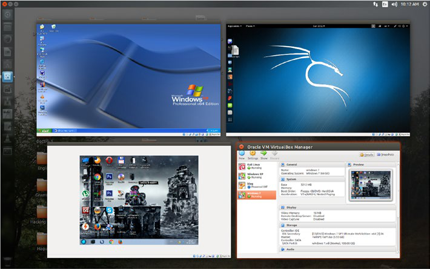

# ■Part III......................................................................... 169

■ Contents
■Chapter 20: Module.................................................................... 149
■Chapter 21: Debugging, Unittest Module.................................... 153
■Chapter 22: Socket and Networking........................................... 157
■Chapter 23: Importing Nmap Module......................................... 159
■Chapter 24: Building an Nmap Network Scanner....................... 165
■Part III......................................................................... 169
■Chapter 25: Protect Anonymity on the Internet.......................... 171
■Chapter 26: Dark Web and Tor.................................................... 173
Hidden Wikipedia................................................................................. 174
■Chapter 27: Proxy Chains........................................................... 179
■Chapter 28: Virtual Private Network or VPN............................... 185
■Chapter 29: MAC Address........................................................... 191
■Epilogue—What Next.................................................................. 195
Index.............................................................................................. 197

About the Author
Sanjib Sinha writes stories and codes—not always in the same order.
He started with C# and .NET framework and won a Microsoft Community
Contributor Award in 2011. Later, the Open Source Software movement attracted him and
he became a Linux, PHP, and Python enthusiast, specializing in and working on White
Hat Ethical Hacking.
As a beginner, he had to struggle a lot—always—to find out an easy way to learn
coding. No one told him that coding is like writing: imagining an image and bringing it
down to Earth with the help of words and symbols.
All through his books he has tried to help beginners from their perspective—as a
beginner.

xiii
About the Technical
Reviewer
Abir Ranjan Atarthy is a Certified Ethical Hacker from Ec-Council, ISO27001 Auditor and
PCIDSS implementer.
He has more than 12 years of extensive domain experience in driving the
Information & Cyber Security programs in all key aspects i.e. Policy, Standards,
Procedures, Awareness, Network Security, Web security, Android App Security, Incident
Response, Security Analytics, Security Monitoring, Malware protection, Security
configuration, Cryptography, Data Protection Knowledge of most advanced tools in
security industry with complementing knowledge on scripting languages to manually
exploit vulnerabilities.
He has authored several technical articles which have been published in IT security
journals and is frequently invited to speak at many cyber security conferences and
Python forums.
He has designed cyber security courses for Corporates on network and web
penetration testing, forensics, and cryptography.
Abir regularly conducts work-shops, training sessions and certification programs
for corporates, government organizations, defence establishments, security agencies,
engineering colleges and universities on Python programming, penetration testing and
cyber forensics.
He has created several IT security and cryptographic tools using Python.
He has accomplished short term Programs in Object-oriented programming and
Selected Topics in Software Engineering from Indian Institute of Technology -Kharagpur.
Abir is considered a subject-matter expert in cyber security and is often quoted by
leading newspapers and TV channels.
Presently he is leading the Cyber threat intelligence department in TCG Digital
Solutions Pvt. Ltd.

Acknowledgments
KARTICK PAUL, SYSTEM MANAGER, AAJKAAL, KOLKATA, Without his persistent and
inspiring help, I could not write this book.

xvii
Prologue – Hacker’s Goal
This book is intended for complete programming beginners or general people who know
nothing about any programming language but want to learn ethical hacking.
Let us clear it first: Ethical Hacking is not associated with any kind of illegal
electronic activities. They always stay within laws. This book is intended for those people
– young and old – who are creative and curious and who want to develop a creative hobby
or take up internet security profession acting as ethical hacker. Keeping that in mind we’ll
also learn Python 3 programming language to enhance our skill as ethical hackers.
This book is not intended for any kind of malicious user. If anyone tries to use this
book or any type of code examples from this book for illegal purpose this book will take
no moral responsibility for that malicious behaviours.
If you think that you can use this book for any malicious purpose then you are
advised to read the first chapter “Legal Side of Ethical Hacking”. I hope you won’t like the
idea of ending up in jail by harming some other systems.
I would like to start this brief introduction with an image. This image depicts many
things that I will later discuss in detail. It says, “The author is using “Ubuntu” Linux
distribution as his default operating system. He has installed Virtual Box – a kind of
virtual machine – that runs in Windows also. And in that Virtual Box he has installed three
more operating systems. One is “Windows XP” and the other two are “Kali Linux” and
“Windows 7 Ultimate”. The image also says, and that is very important, “Currently three
operating systems are virtually running on the desktop”.

■ Prologue – Hacker’s Goal
xviii
(The virtual Box is running three operating systems. You can try any kind of
experiment on this Virtual OS. That will not damage your main system.)
As an ethical hacker you will learn how to defend yourself. To defend yourself
sometime you need to attack your enemy. But it is a part of your defense system. It is a
part of your defense strategy. More you know about your enemy’s strategy, more you
can defend yourself. You need to learn those tools are frequently used by the malicious
hackers or crackers. They use the same tool that you use to defend yourself.
Whether you are an ethical hacker or a malicious cracker, you do the same thing.
You use the identical software tools to attack the security system. Only your purpose or
intention differs.
Probably you know that a big car company before launching a new model of
car generally tests the locking system. They have their own security engineers and
besides they call for the locking experts to test the vulnerability. They pay a good
amount of money if you can break the locking system of the car. Basically it is a work
of “PENTESTING”. The locking experts PENTESTS the system and see if there is any
weakness in the system.
It is good example of ethical hacking. The locking experts are invited to do the
job and they are paid well. On the contrary car thieves do the same job without any
invitation. They simply break the locking system of an unattended car parked on the road
side and take it away. I hope by now you have understood the difference between ethical
hacking and cracking.

■ Prologue – Hacker’s Goal
xix
Your main intention centers on the security of the system. Security consists of four
key components. As the book progresses you will increasingly be finding words like
“PENTESTING”, “EXPLOIT”, “PENETRATION”, “BREAK IN THE SYSTEM”, “COMPROMISE
THE ROUTER” etcetera. The four key components mentioned below mainly deal with
these terms. The key components are:
Availability
Integrity
Authenticity
Confidentiality
We will see how crackers want to attack these components to gain access to the
system. Since a hacker’s main goal is to exploit the vulnerabilities of the system so he
wants to see if there is any weakness in these core components.
Let us assume the hacker wants to block the availability of the data. In that case he
will use the “Denial of Attack” or ‘DoS’ method. To do this attack usually hackers use
system’s resource or bandwidth. But DoS has many other forms. When the resource or
bandwidth of your system is eaten up completely, the server usually crashes. The final
target is one system but the number of victims is plenty. It is something like millions of
people gather in front your house main door and jam it with a kind of human chain so
that you and your family members can not enter into it.
The second key component Integrity should not be compromised at any cost. What
does this term “integrity” mean? It’s basically centered on the nature of data. When this
nature of data is tampered with some kind of ‘BIT-FLIPPING’ attacks, the integrity of the
system is also compromised. It can be done just by changing the message itself. The data
may either be in the move or at rest, but it can be changed. Imagine what happens when
a transaction of money is tampered with the addition of few more zeroes at the end! Let
us assume a bank is transferring money. In its instruction it is written: “transfer $10, 000”.
Now the attacker changes the cryptic text in such a manner so that the amount changes to
$10, 000000. So the attack is intended for the message itself or a series of messages.
The issue of authentication is normally handled by the Media Access Control (MAC)
filtering. If it is properly placed the network does not allow unauthorized device. What
happens if someone spoofs the MAC Address of a legitimate network station and takes it
off? He can take on the station’s identity and control it. This is called authentication attack
or MAC Address spoofing.
Finally the issue of confidentiality rises above all. Data travel in clear text across
the trusted network. Here data mean information. The information theft like cracking
someone’s password is confidentiality attack. The data or information is intended for
someone but instead of the recipient the hacker gains the access. Actually the cracker
steals it when the data is moving across the trusted network as clear text.

| 1 | Availability |
|---|---|
| 2 | Integrity |
| 3 | Authenticity |
| 4 | Confidentiality |

## Images and Figures

